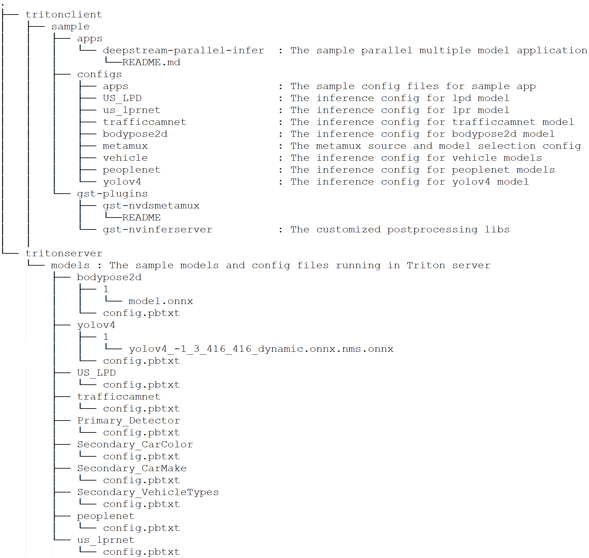
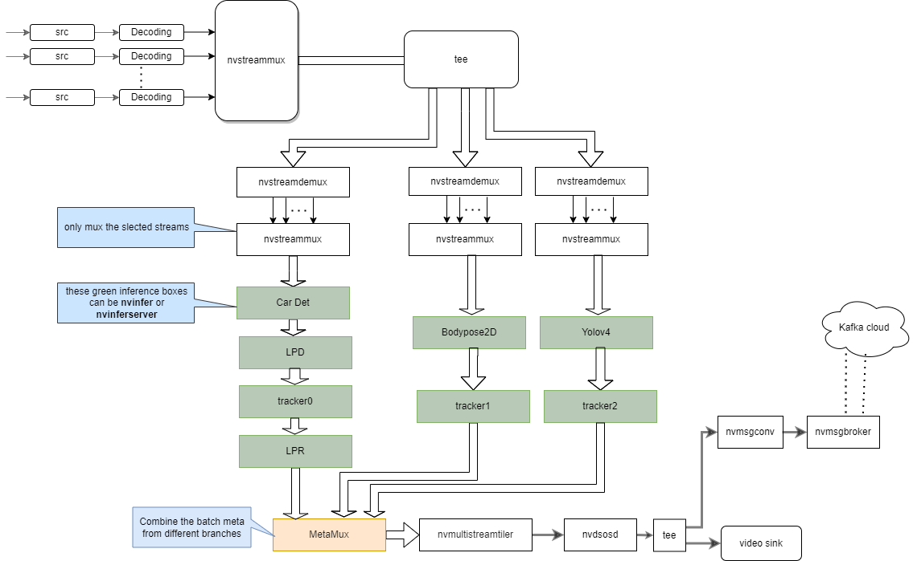
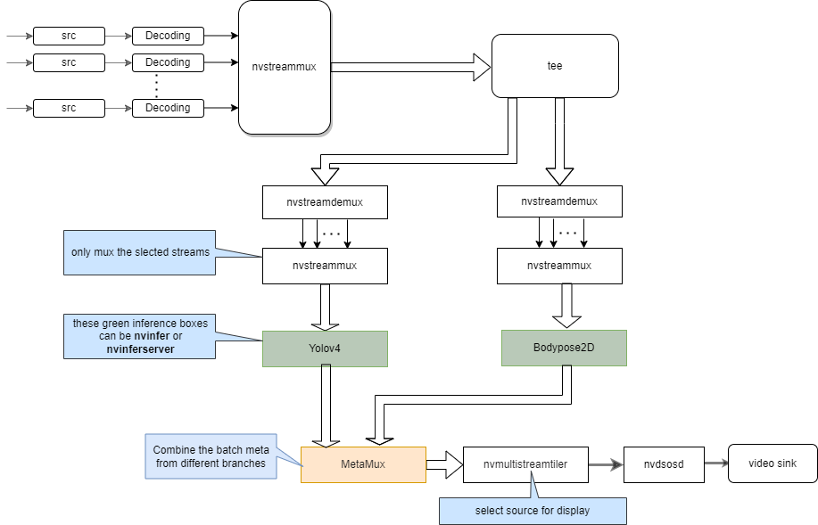

# Parallel Multiple Models App
## Introduction
The parallel inferencing application construct the parallel inferencing branches pipeline as the following graph, so that the multiple models can run in parallel in one piepline.


## Main features

* Support multiple models inference in parallel
* Support sources selection for different models
* Support output meta selection for different sources and different models

Since DeepStream 6.1.1 release, a new DeepStream plugins are introduced.

* **gst-nvdsmetamux** : New plugin for NvDsMeta data mux and selection for different sources and different models (inferenced by nvdstritonclient, nvinfer or nvinferserver).

Deatails for the plugins and sample app, please refer to the following README files in the package:

- tritonclient/sample/gst-plugins/gst-nvdsmetamux/README
- tritonclient/sample/apps/deepstream-parallel-infer/README.md

The sample application can run parallel models with nvinfer and nvinferserver. There are some sample inferserver configurations for Yolov4 and bodypose2d models. The details for configure gst-nvinferserver to inference with NVIDIA® Triton Inference Server, please refer to https://docs.nvidia.com/metropolis/deepstream/dev-guide/text/DS_plugin_gst-nvinferserver.html

# Directory


# Prerequisition
The sample app support nvdsmsgbroker, the configuration is the same as /opt/nvidia/deepstream/deepstream/sources/apps/sample_apps/deepstream-test5/README part 5.1

For example, to enable Kafka protocol, you need to make sure the Kafka server needs the server version equal or higher than kafka_2.12-3.2.0. 

And in DeepStream side, you need to install the dependencies of Kafka according to the instruction in DeepStream development guide.
https://docs.nvidia.com/metropolis/deepstream/dev-guide/text/DS_plugin_gst-nvmsgbroker.html#nvds-kafka-proto-kafka-protocol-adapter

For x86 platform, since some sample models work with [nvinferserver](https://docs.nvidia.com/metropolis/deepstream/dev-guide/text/DS_plugin_gst-nvinferserver.html), the NVIDIA® Triton Inference Server should be installed. The [DeepStream Triton docker container](https://catalog.ngc.nvidia.com/orgs/nvidia/containers/deepstream) can also be used for convenience. 

# Steps To Run the Sample App

The sample should be download and build with root.

1. Download the source code
```
apt install git-lfs
git lfs install
git clone https://github.com/NVIDIA-AI-IOT/deepstream_parallel_inference_app.git
```
If the git LFS download fails to download the sample models of bodypose2d and YoloV4, use the https://drive.google.com/drive/folders/1GJEGQSg6qlWuNqUVVlNOxR6AGMNLfkYN?usp=sharing link to download the sample models.

2. Prepare the sample Yolov4, bodypose2d, trafficcamnet, LPD and LPR models and prepare the enviroment.

For dGPU

Use the DeepStream Triton docker to run the sample on x86. https://docs.nvidia.com/metropolis/deepstream/dev-guide/text/DS_Quickstart.html#deepstream-triton-inference-server-usage-guidelines
```
cd deepstream_parallel_inference_app/tritonserver
./gen_engine_dgpu.sh
export CUDA_VER=11.7
```

For Jetson
```
cd /opt/nvidia/deepstream/deepstream/samples
./triton_backend_setup.sh
cd -
cd deepstream_parallel_inference_app/tritonserver
./gen_engine_jetson.sh
export CUDA_VER=11.4
apt-get install libjson-glib-dev libgstrtspserver-1.0-dev
export LD_PRELOAD=/usr/lib/aarch64-linux-gnu/libgomp.so.1
```

3. Build and run the sample application

```
cd ../tritonclient/sample
make
export NVSTREAMMUX_ADAPTIVE_BATCHING=yes
rm -rf ~/.cache/gstreamer-1.0/
wget 'https://api.ngc.nvidia.com/v2/models/nvidia/tao/lprnet/versions/deployable_v1.0/files/us_lp_characters.txt' -O dict.txt
./apps/deepstream-parallel-infer/deepstream-parallel-infer -c configs/apps/bodypose_yolo_lpr/source4_1080p_dec_parallel_infer.yml
```

# Parallel inferencing application configuration
The parallel inferencing app uses the YAML configuration file to config GIEs, sources, and other features of the pipeline. The basic group semantics is the same as [deepstream-app](https://docs.nvidia.com/metropolis/deepstream/dev-guide/text/DS_ref_app_deepstream.html#expected-output-for-the-deepstream-reference-application-deepstream-app).

Please refer to deepstream-app [Configuration Groups](https://docs.nvidia.com/metropolis/deepstream/dev-guide/text/DS_ref_app_deepstream.html#configuration-groups) part for the semantics of corresponding groups.

There are additional new groups introduced by the parallel inferencing app which enable the app to select sources for different inferencing branches and to select output metadata for different inferencing GIEs:

### Branch Group 
The branch group specifies the sources to be infered by the specific inferencing branch. The selected sources are identified by the source IDs list. The inferencing branch is identified by the first PGIE unique-id in this branch. For example:
```
branch0:
  key1: value1
  key2: value2
```

The branch group properties are:

| Key   |     Meaning                                           | Type and Value                   | Example        | Plateforms |
|-------|-------------------------------------------------------|----------------------------------|----------------|------------|
|pgie-id|the first PGIE unique-id in this branch                | Integer, >0                      |pgie-id: 8      |dGPU, Jetson|
|src-ids|The source-id list of selected sources for this branch | Semicolon separated integer array|src-ids: 0;2;5;6|dGPU, Jetson|

### Metamux Group

The metamux group specifies the configuration file of gst-dsmetamux plugin. For example:
```
meta-mux:
  key1: value1
  key2: value2
```
The metamux group properties are:

| Key       |     Meaning                                                | Type and Value | Example                         | Plateforms |
|-----------|------------------------------------------------------------|----------------|---------------------------------|------------|
| enable    |Indicates whether the MetaMux must be enabled.              | Boolean        |enable=1                         |dGPU, Jetson|
|config-file|Pathname of the configuration file for gst-dsmetamux plugin | String         |config-file: ./config_metamux.txt|dGPU, Jetson|

The gst-dsmetamux configuration details are introduced in gst-dsmetamux plugin README. 

# Sample Models

The sample application uses the following models as samples.

|Model Name | Inference Type |                     source                                |
|-----------|-------------------|-----------------------------------------------------------|
|bodypose2d |nvinfer, nvinferserver|https://github.com/NVIDIA-AI-IOT/deepstream_pose_estimation|
|YoloV4     |nvinfer, nvinferserver|https://github.com/NVIDIA-AI-IOT/yolov4_deepstream|
|peoplenet|nvinferserver|https://catalog.ngc.nvidia.com/orgs/nvidia/teams/tao/models/peoplenet|
|Primary Car detection|nvinferserver|DeepStream SDK|
|Secondary Car color|nvinferserver|DeepStream SDK|
|Secondary Car maker|nvinferserver|DeepStream SDK|
|Secondary Car type|nvinferserver|DeepStream SDK|
|trafficcamnet|nvinferserver|https://catalog.ngc.nvidia.com/orgs/nvidia/teams/tao/models/trafficcamnet|
|LPD|nvinferserver|https://catalog.ngc.nvidia.com/orgs/nvidia/teams/tao/models/lpdnet|
|LPR|nvinferserver|https://catalog.ngc.nvidia.com/orgs/nvidia/teams/tao/models/lprnet|

# Generates inferencing branches with configuration files

The keys features of the parallel inferencing application are:
* Support multiple models inference in parallel branches
* Support sources selection for different models
* Support output metadata selection for different sources and different models

The application will create new inferencing branch for every primary GIE. The secondary GIEs should identify the primary GIE on which they work by setting "operate-on-gie-id" in nvinfer or nvinfereserver configuration file.

To make every inferencing branch unique and identifiable, the "unique-id" for every GIE should be different and unique. The gst-dsmetamux module will rely on the "unique-id" to identify the metadata comes from which model.

There are two sample configurations in current project for reference.

* The sample configuration for the open source YoloV4, bodypose2d and TAO car license plate identification models with nvinferserver.

  - Configuration folder

    tritonclient/sample/configs/apps/bodypose_yolo_lpr

    "source4_1080p_dec_parallel_infer.yml" is the application configuration file. The other configuration files are for different modules in the pipeline, the application configuration file uses these files to configure different modules.

  - Pipeline Graph:

    
  - App Command:

    ``
    ./apps/deepstream-parallel-infer/deepstream-parallel-infer -c configs/apps/bodypose_yolo_lpr/source4_1080p_dec_parallel_infer.yml
    ``

* The sample configuration for the TAO vehicle classifications, carlicense plate identification and peopleNet models with nvinferserver.

  - Configuration folder

    tritonclient/sample/configs/apps/vehicle_lpr_analytic

    "source4_1080p_dec_parallel_infer.yml" is the application configuration file. The other configuration files are for different modules in the pipeline, the application configuration file uses these files to configure different modules.

  - Pipeline Graph:

    

  - App Command:

    ``
    ./apps/deepstream-parallel-infer/deepstream-parallel-infer -c configs/apps/vehicle_lpr_analytic/source4_1080p_dec_parallel_infer.yml
    ``
* The sample configuration for the TAO vehicle classifications, carlicense plate identification and peopleNet models with nvinferserver and nvinfer.

  - Configuration folder

    tritonclient/sample/configs/apps/vehicle0_lpr_analytic

    "source4_1080p_dec_parallel_infer.yml" is the application configuration file. The other configuration files are for different modules in the pipeline, the application configuration file uses these files to configure different modules. The vehicle branch uses nvinfer, the car plate and the peoplenet branches use nvinferserver.

  - Pipeline Graph:

    

  - App Command:

    ``
    ./apps/deepstream-parallel-infer/deepstream-parallel-infer -c configs/apps/vehicle0_lpr_analytic/source4_1080p_dec_parallel_infer.yml
    ``
* The sample configuration for the open source YoloV4, bodypose2d with nvinferserver and nvinfer.

  - Configuration folder

    tritonclient/sample/configs/apps/bodypose_yolo/

    "source4_1080p_dec_parallel_infer.yml" is the application configuration file. The other configuration files are for different modules in the pipeline, the application configuration file uses these files to configure different modules. The bodypose branch uses nvinfer, the yolov4 branch use nvinferserver. The output streams is tiled.

  - Pipeline Graph:

    

  - App Command:

    ``
    ./apps/deepstream-parallel-infer/deepstream-parallel-infer -c configs/apps/bodypose_yolo/source4_1080p_dec_parallel_infer.yml
    ``
* The sample configuration for the open source YoloV4, bodypose2d with nvinferserver and nvinfer.

  - Configuration folder

    tritonclient/sample/configs/apps/bodypose_yolo_win1/

    "source4_1080p_dec_parallel_infer.yml" is the application configuration file. The other configuration files are for different modules in the pipeline, the application configuration file uses these files to configure different modules. The bodypose branch uses nvinfer, the yolov4 branch use nvinferserver. The output streams is source 2.

  - Pipeline Graph:

    

  - App Command:

    ``
    ./apps/deepstream-parallel-infer/deepstream-parallel-infer -c configs/apps/bodypose_yolo_win1/source4_1080p_dec_parallel_infer.yml
    ``
