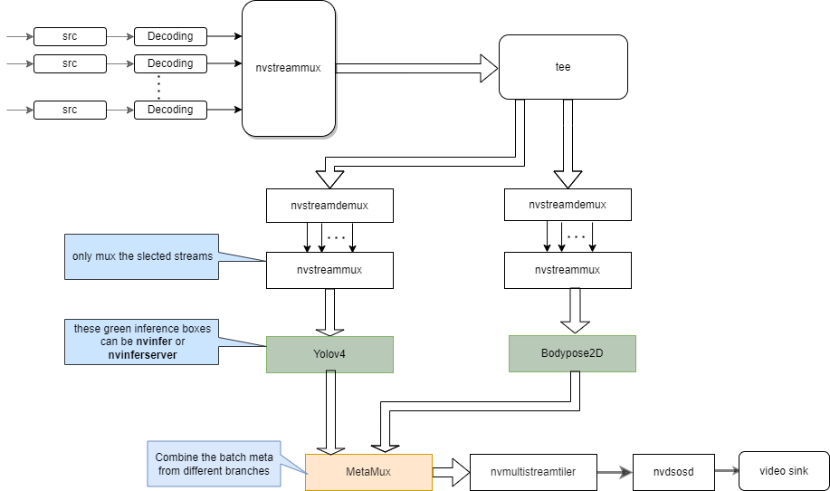

# Parallel Multiple Models App
## Introduction
The parallel inferencing application constructs the parallel inferencing branches pipeline as the following graph, so that the multiple models can run in parallel in one pipeline.


## Main Features

* Support multiple models inference with [nvinfer](https://docs.nvidia.com/metropolis/deepstream/dev-guide/text/DS_plugin_gst-nvinfer.html)(TensorRT) or [nvinferserver](https://docs.nvidia.com/metropolis/deepstream/dev-guide/text/DS_plugin_gst-nvinferserver.html)(Triton) in parallel
* Support sources selection for different models with [nvstreammux](https://docs.nvidia.com/metropolis/deepstream/dev-guide/text/DS_plugin_gst-nvstreammux.html) and [nvstreamdemux](https://docs.nvidia.com/metropolis/deepstream/dev-guide/text/DS_plugin_gst-nvstreamdemux.html)
* Support to mux output meta from different sources and different models with **gst-nvdsmetamux** plugin newly introduced in DeepStream 6.1.1


# Prerequisites
- DeepStream 6.1.1, especially
  - [nvmsgbroker](https://docs.nvidia.com/metropolis/deepstream/dev-guide/text/DS_plugin_gst-nvmsgbroker.html) if you want to enable nvmsgbroker sink, e.g. [Kafka](https://docs.nvidia.com/metropolis/deepstream/dev-guide/text/DS_plugin_gst-nvmsgbroker.html#nvds-kafka-proto-kafka-protocol-adapter)
  - [nvinferserver](https://docs.nvidia.com/metropolis/deepstream/dev-guide/text/DS_plugin_gst-nvinferserver.html) if running model with Triton
- Cloud server, e.g. Kafka server (version >= kafka_2.12-3.2.0), if you want to enable broker sink


# Steps To Run

The sample should be downloaded and built with **root** permission.

1. Download 
   ```
   apt install git-lfs
   git lfs install --skip-repo
   git clone https://github.com/NVIDIA-AI-IOT/deepstream_parallel_inference_app.git
   ``` 
   If git-lfs download fails for bodypose2d and YoloV4 models, get them from Google Drive [link](https://drive.google.com/drive/folders/1GJEGQSg6qlWuNqUVVlNOxR6AGMNLfkYN?usp=sharing)  
2. Generate Inference Engines 
   
   Below instructions are only needed on **Jetson** ([Jetpack 5.0.2](https://developer.nvidia.com/embedded/jetpack-sdk-502))
   ```
   apt-get install -y libjson-glib-dev libgstrtspserver-1.0-dev
   /opt/nvidia/deepstream/deepstream/samples/triton_backend_setup.sh
   cp tritonclient/sample/gst-plugins/gst-nvdsmetamux/libnvdsgst_metamux.so \
              /opt/nvidia/deepstream/deepstream/lib/gst-plugins/libnvdsgst_metamux.so
   nvpmodel -m 0 && jetson_clocks      ## set power model and boost CPU/GPU/EMC clocks
   ``` 
   Below instructions are needed for both  **Jetson** and **dGPU** (DeepStream Triton docker - [6.1.1-triton](https://catalog.ngc.nvidia.com/orgs/nvidia/containers/deepstream/tags)) 
   ```
   cd tritonserver/
   ./build_engine.sh       ## this will take 1~2 hours to build TensorRT engines
   ``` 
3. Build and Run 
   ```
   cd tritonclient/sample/
   source build.sh
   ./apps/deepstream-parallel-infer/deepstream-parallel-infer \
                -c configs/apps/bodypose_yolo_lpr/source4_1080p_dec_parallel_infer.yml
   ``` 


# Directory


# Application Configuration Semantics

The parallel inferencing app uses the YAML configuration file to config GIEs, sources, and other features of the pipeline. The basic group semantics is the same as [deepstream-app](https://docs.nvidia.com/metropolis/deepstream/dev-guide/text/DS_ref_app_deepstream.html#expected-output-for-the-deepstream-reference-application-deepstream-app).

Please refer to deepstream-app [Configuration Groups](https://docs.nvidia.com/metropolis/deepstream/dev-guide/text/DS_ref_app_deepstream.html#configuration-groups) part for the semantics of corresponding groups.

There are additional new groups introduced by the parallel inferencing app which enable the app to select sources for different inferencing branches and to select output metadata for different inferencing GIEs:

### Branch Group 
The branch group specifies the sources to be infered by the specific inferencing branch. The selected sources are identified by the source IDs list. The inferencing branch is identified by the first PGIE unique-id in this branch. For example:
```
branch0:
  key1: value1
  key2: value2
```

The branch group properties are:

| Key   |     Meaning                                           | Type and Value                   | Example        | Plateforms |
|-------|-------------------------------------------------------|----------------------------------|----------------|------------|
|pgie-id|the first PGIE unique-id in this branch                | Integer, >0                      |pgie-id: 8      |dGPU, Jetson|
|src-ids|The source-id list of selected sources for this branch | Semicolon separated integer array|src-ids: 0;2;5;6|dGPU, Jetson|

### Metamux Group

The metamux group specifies the configuration file of gst-dsmetamux plugin. For example:
```
meta-mux:
  key1: value1
  key2: value2
```
The metamux group properties are:

| Key       |     Meaning                                                | Type and Value | Example                         | Plateforms |
|-----------|------------------------------------------------------------|----------------|---------------------------------|------------|
| enable    |Indicates whether the MetaMux must be enabled.              | Boolean        |enable=1                         |dGPU, Jetson|
|config-file|Pathname of the configuration file for gst-dsmetamux plugin | String         |config-file: ./config_metamux.txt|dGPU, Jetson|

The gst-dsmetamux configuration details are introduced in gst-dsmetamux plugin README. 

# Sample Models

The sample application uses the following models as samples.

|Model Name | Inference Plugin |                     source                                |
|-----------|-------------------|-----------------------------------------------------------|
|bodypose2d |nvinfer, nvinferserver|https://github.com/NVIDIA-AI-IOT/deepstream_pose_estimation|
|YoloV4     |nvinfer, nvinferserver|https://github.com/NVIDIA-AI-IOT/yolov4_deepstream|
|peoplenet|nvinferserver|https://catalog.ngc.nvidia.com/orgs/nvidia/teams/tao/models/peoplenet|
|Primary Car detection|nvinferserver|DeepStream SDK|
|Secondary Car color|nvinferserver|DeepStream SDK|
|Secondary Car maker|nvinferserver|DeepStream SDK|
|Secondary Car type|nvinferserver|DeepStream SDK|
|trafficcamnet|nvinferserver|https://catalog.ngc.nvidia.com/orgs/nvidia/teams/tao/models/trafficcamnet|
|LPD|nvinferserver|https://catalog.ngc.nvidia.com/orgs/nvidia/teams/tao/models/lpdnet|
|LPR|nvinferserver|https://catalog.ngc.nvidia.com/orgs/nvidia/teams/tao/models/lprnet|

# Sample Configuration Files

The application will create new inferencing branch for the designated primary GIE. The secondary GIEs should identify the primary GIE on which they work by setting "operate-on-gie-id" in nvinfer or nvinfereserver configuration file.

To make every inferencing branch unique and identifiable, the "unique-id" for every GIE should be different and unique. The gst-dsmetamux module will rely on the "unique-id" to identify the metadata comes from which model.

There are five sample configurations in current project for reference.

* The sample configuration for the open source YoloV4, bodypose2d and TAO car license plate identification models with nvinferserver.

  - Configuration folder

    tritonclient/sample/configs/apps/bodypose_yolo_lpr

    "source4_1080p_dec_parallel_infer.yml" is the application configuration file. The other configuration files are for different modules in the pipeline, the application configuration file uses these files to configure different modules.

  - Pipeline Graph:

    
  - App Command:

    ``
    ./apps/deepstream-parallel-infer/deepstream-parallel-infer -c configs/apps/bodypose_yolo_lpr/source4_1080p_dec_parallel_infer.yml
    ``

* The sample configuration for the TAO vehicle classifications, carlicense plate identification and peopleNet models with nvinferserver.

  - Configuration folder

    tritonclient/sample/configs/apps/vehicle_lpr_analytic

    "source4_1080p_dec_parallel_infer.yml" is the application configuration file. The other configuration files are for different modules in the pipeline, the application configuration file uses these files to configure different modules.

  - Pipeline Graph:

    

  - App Command:

    ``
    ./apps/deepstream-parallel-infer/deepstream-parallel-infer -c configs/apps/vehicle_lpr_analytic/source4_1080p_dec_parallel_infer.yml
    ``
* The sample configuration for the TAO vehicle classifications, carlicense plate identification and peopleNet models with nvinferserver and nvinfer.

  - Configuration folder

    tritonclient/sample/configs/apps/vehicle0_lpr_analytic

    "source4_1080p_dec_parallel_infer.yml" is the application configuration file. The other configuration files are for different modules in the pipeline, the application configuration file uses these files to configure different modules. The vehicle branch uses nvinfer, the car plate and the peoplenet branches use nvinferserver.

  - Pipeline Graph:

    

  - App Command:

    ``
    ./apps/deepstream-parallel-infer/deepstream-parallel-infer -c configs/apps/vehicle0_lpr_analytic/source4_1080p_dec_parallel_infer.yml
    ``
* The sample configuration for the open source YoloV4, bodypose2d with nvinferserver and nvinfer.

  - Configuration folder

    tritonclient/sample/configs/apps/bodypose_yolo/

    "source4_1080p_dec_parallel_infer.yml" is the application configuration file. The other configuration files are for different modules in the pipeline, the application configuration file uses these files to configure different modules. The bodypose branch uses nvinfer, the yolov4 branch use nvinferserver. The output streams is tiled.

  - Pipeline Graph:

    

  - App Command:

    ``
    ./apps/deepstream-parallel-infer/deepstream-parallel-infer -c configs/apps/bodypose_yolo/source4_1080p_dec_parallel_infer.yml
    ``
* The sample configuration for the open source YoloV4, bodypose2d with nvinferserver and nvinfer.

  - Configuration folder

    tritonclient/sample/configs/apps/bodypose_yolo_win1/

    "source4_1080p_dec_parallel_infer.yml" is the application configuration file. The other configuration files are for different modules in the pipeline, the application configuration file uses these files to configure different modules. The bodypose branch uses nvinfer, the yolov4 branch use nvinferserver. The output streams is source 2.

  - Pipeline Graph:

    

  - App Command:

    ``
    ./apps/deepstream-parallel-infer/deepstream-parallel-infer -c configs/apps/bodypose_yolo_win1/source4_1080p_dec_parallel_infer.yml
    ``
